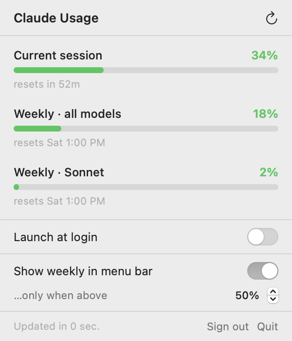

# Claude Usage

A tiny macOS menu bar app that shows your Claude plan usage at a glance — a
doughnut gauge with your current 5‑hour session percentage and the time until it
resets, plus your weekly limits in a click‑down panel.

No more digging through the website or app just to see how much of your session
you've used.

<p align="center">
  
  &nbsp;
  
  &nbsp;
  
</p>
<p align="center"></p>

📖 **[Full documentation &amp; screenshots →](https://wfk95.github.io/claude-usage/)**

> Every screenshot is rendered from the app's real code — run `./docs/build-docs.sh`
> to regenerate them, so the docs never drift from the app.

## Features

- **Menu bar doughnut** showing current‑session usage, color‑coded green → yellow → red.
- **Time‑to‑reset** right next to it (`52m`, `1h4m`).
- **Click‑down panel** with all three limits (session, weekly all‑models, weekly Sonnet) and reset times.
- **Weekly in the bar when it matters** — optionally surface the weekly figure only once it crosses a threshold you set (default 50%).
- **Sign in with Claude** (OAuth, PKCE). Your token is stored in your macOS Keychain and auto‑refreshes.
- **Launch at login** toggle.
- Auto‑refreshes every 60s and on each open.

## Requirements

- macOS 13 (Ventura) or later (Apple Silicon or Intel)
- To build from source: Xcode Command Line Tools (`xcode-select --install`) — no full Xcode needed

## Download (pre-built)

Grab the latest **ClaudeUsage.zip** from the
[**Releases**](https://github.com/wfk95/claude-usage/releases) page, unzip it,
and move `ClaudeUsage.app` to `/Applications`.

The app is ad-hoc signed but **not notarized** (there's no paid Apple Developer
account behind it), so macOS Gatekeeper warns on first launch. Allow it once:

- **Right-click** the app → **Open** → **Open**, or
- open it, then **System Settings → Privacy & Security → Open Anyway**, or
- run: `xattr -dr com.apple.quarantine /Applications/ClaudeUsage.app`

## Build & run

```bash
git clone https://github.com/<you>/claude-usage.git
cd claude-usage
./build.sh
open build/ClaudeUsage.app
```

Click **Sign in** in the menu bar, approve in the browser that opens, copy the
code it shows you, and paste it back into the app. Done.

### Build a universal binary (Apple Silicon + Intel)

```bash
UNIVERSAL=1 ./build.sh
```

`./release.sh` does this and zips the result — the same artifact the GitHub
Actions release workflow ships when you push a `v*` tag.

## How it works

The app reads the same usage data the Claude apps show, from the endpoint the
Claude CLI uses for its `/usage` command:

```
GET https://api.anthropic.com/api/oauth/usage
Authorization: Bearer <your token>
anthropic-beta: oauth-2025-04-20
```

It returns the 5‑hour session bucket and the weekly buckets, which map directly
to the bars you see.

Sign‑in uses the standard OAuth 2.0 authorization‑code + PKCE flow. The access
and refresh tokens live in your **own** Keychain entry (`com.fk.ClaudeUsage`) —
the app never touches the entry the Claude CLI manages.

## Project layout

```
build.sh              Compiles Sources/ into ClaudeUsage.app (no Xcode project)
make_icon.{swift,sh}  Generates the app icon (Resources/AppIcon.icns)
docs/                 GitBook-style site; build-docs.sh renders the screenshots
Sources/
  AppDelegate.swift   Menu bar item, popover, sign-in dialog
  AppModel.swift      State + polling + formatting
  OAuth.swift         PKCE sign-in, token exchange/refresh
  UsageAPI.swift      Usage endpoint + response model
  UsageView.swift     The click-down SwiftUI panel
  SettingsStore.swift Persisted preferences
  MenuBarIcon.swift   The doughnut renderer
  Keychain.swift      Token storage
  LaunchAtLogin.swift Login-item toggle (SMAppService)
```

## ⚠️ Disclaimer

This is an **unofficial** tool and is **not affiliated with, endorsed by, or
supported by Anthropic**. It relies on a private, undocumented endpoint that may
change or stop working at any time. It is intended for personal use with your
own account. "Claude" is a trademark of Anthropic — this project uses the name
only to describe what it does. Use at your own risk.

## License

[MIT](LICENSE) © 2026 Fengkai Wan
